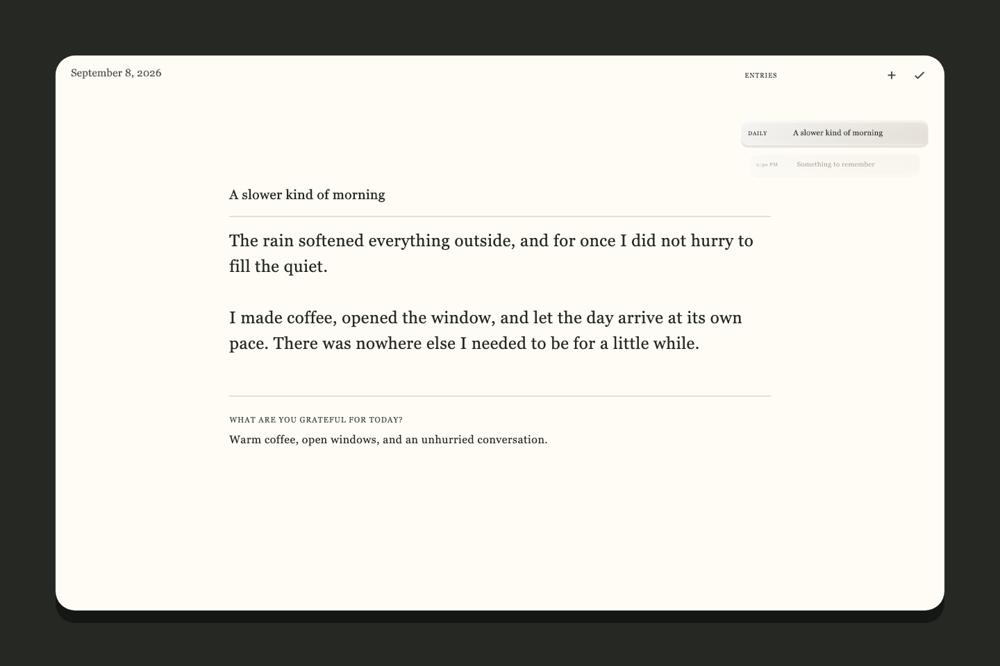
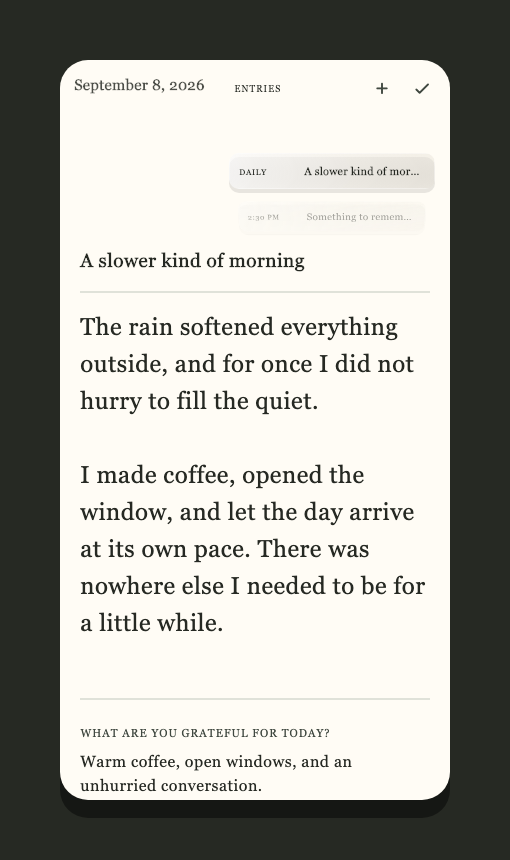
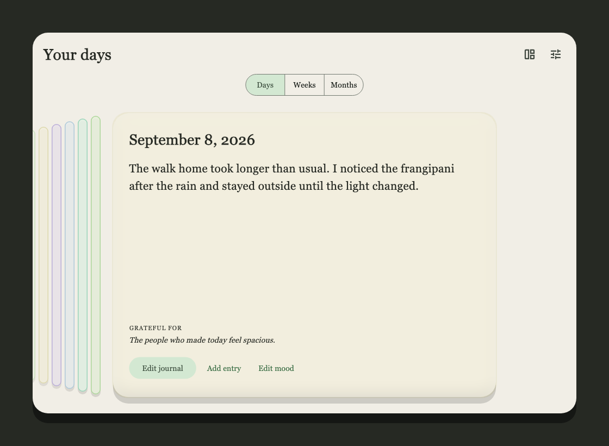
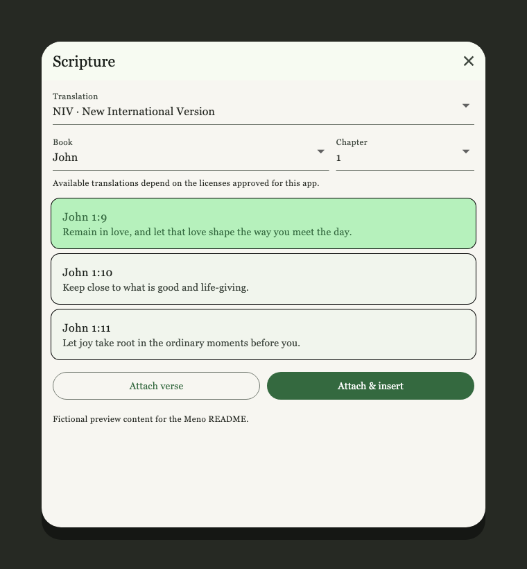

<div align="center">
  

  <p><em>A private place to notice, reflect, and remember.</em></p>

  <p>
    <strong>Private and local-first</strong>&nbsp;&nbsp;·&nbsp;&nbsp;
    <strong>Calm daily journaling</strong>&nbsp;&nbsp;·&nbsp;&nbsp;
    <strong>Optional on-device organization</strong>
  </p>
</div>

<br>



Meno is a quiet journal for desktop and mobile. It gives each day a spacious
page for writing, a gentle mood check-in, and a binder for returning to the
moments you have kept. Your journal lives on your device, works without an
account, and does not need an internet connection or AI model.

## Why Meno

| A calmer page                                                                | A sense of time                                                                         | Memory without surveillance                                                                           |
| ---------------------------------------------------------------------------- | --------------------------------------------------------------------------------------- | ----------------------------------------------------------------------------------------------------- |
| A warm, full-page editor keeps the interface out of the way while you write. | Daily pages, gratitude, mood, and additional notes stay together in a browsable binder. | Search, tags, and related entries can run locally; generated suggestions never replace your own tags. |

- Write one Daily Journal and any number of additional entries for each day.
- Record gratitude and a reflective mood without turning either into a score or
  diagnosis.
- Move naturally between days, weeks, and months in the horizontal binder.
- Add an optional Quiet Time workspace for personal reflection and linked
  Scripture references.

## A small tour

### Write without clutter

Large type, generous spacing, and a gratitude footer leave room for the day to
unfold—even on a smaller screen.

<p align="center">
  
</p>

### Return to what mattered

Browse recorded days as pages, with mood colour and nearby entries providing
quiet context.

<p align="center">
  
</p>

### Quiet Time

Enable Quiet Time only when you want Scripture references and structured
reflection fields.

<p align="center">
  
</p>

## Your journal stays yours

Journal writing, gratitude, mood, tags, relationships, Scripture attachments,
and preferences are stored on the device. The core journal has no account and
makes no network requests.

Network access is limited to features you choose to use:

- **Smart Organization** can download an optional semantic model on demand.
  Without it, local keyphrase tagging, search, and shared-tag relationships
  continue to work.
- **Quiet Time** requests the Scripture passage you explicitly select from
  YouVersion. Meno stores your reflection and the structured reference, not the
  licensed passage text.

No API keys are stored in this repository.

## Download the macOS preview

<p align="center">
  <a href="https://github.com/lostmusician/meno/releases/latest/download/Meno.dmg"><strong>Download Meno for macOS</strong></a>
</p>

> **Early preview:** This build is not yet signed or notarized. After trying to
> open Meno for the first time, open **System Settings → Privacy & Security**,
> scroll down, select **Open Anyway**, and confirm with **Open**. Only use this
> override when you downloaded Meno from this repository.

The SHA-256 checksum published with each GitHub Release can be used to verify
that the download arrived unchanged. macOS 14 or newer is recommended.

### Run from source

The repository also includes iOS, Android, and Windows projects.

Install [Flutter](https://docs.flutter.dev/get-started/install) and the platform
toolchain for your device, then run:

```sh
flutter pub get
flutter run -d macos
```

Use `flutter devices` to find an attached phone, simulator, or another desktop
target and pass its identifier to `flutter run -d`.

## Optional layers

### Smart Organization

Smart Organization is local-first and can be turned off at any time:

- RAKE-based keyphrase extraction creates editable tags without downloading a
  model.
- Full-text search filters by text, tag, purpose, Scripture book, and date.
- Related Entries surfaces the strongest useful cross-references.
- A bounded Connections graph keeps the overview readable.
- An optional quantized
  [Snowflake Arctic Embed XS](https://huggingface.co/Snowflake/snowflake-arctic-embed-xs)
  ONNX model improves English-first semantic matching. It downloads only when
  requested and is verified before use.

### Quiet Time

Quiet Time is hidden until enabled. It adds:

- A continuous Scripture reader shown in a sliding split view on desktop and
  as a draggable, near-full-height sheet on phones.
- Single-verse and contiguous-range selection with linked, borderless verse
  blocks below the journal text.
- Quiet Time entries with optional Observation, Application, and Prayer fields.
- Translation access when the app has an approved registration, the requested
  version is licensed, and the device is online.

Only user-authored reflection and structured Scripture references are embedded.
Licensed passage text is resolved on demand and is not stored in journal
records.

<details>
<summary><strong>Development and architecture</strong></summary>

### Project structure

- `lib/models` — journal, discovery, embedding, and Scripture data types.
- `lib/services/database_schema.dart` — the current SQLite schema.
- `lib/services/database_service.dart` — runtime persistence, FTS5,
  pagination, transactions, and local search.
- `lib/services/keyphrase_service.dart` — RAKE extraction and journal-specific
  phrase filtering.
- `lib/services/embedding_service.dart` — model lifecycle, checksum validation,
  tokenization, and ONNX inference.
- `lib/services/organization_service.dart` — tagging, canonicalization,
  indexing, and related-entry ranking.
- `lib/services/bible_service.dart` — licensed YouVersion access.
- `lib/providers` — time-aware routing, editor state, binder navigation, and
  optional-service capabilities.
- `lib/ui` — mood, editor, binder, discovery, settings, and Scripture views.

The app uses ordered, transactional schema migrations and refuses databases
created by a newer Meno build without modifying them. It creates daily local
snapshots, supports checksummed `.meno-backup` archives and readable Markdown
exports, and flushes pending edits before a normal macOS quit. Drafts autosave
after 700 ms of inactivity; an abrupt process or power failure can lose at most
that current debounce interval. Optional back-catalog indexing is cancellable
and never blocks journal editing.

The first trusted release uses the permanent `com.ivanchiew.meno` identity. A
one-time bridge build using the former Sotto identity can archive and merge the
existing `sotto.sqlite` history, then create a backup for restoration into the
clean Meno app. The bridge never deletes either legacy source database.

</details>

<details>
<summary><strong>Verification and platform status</strong></summary>

### Checks

```sh
flutter analyze
flutter test
flutter build macos --debug
flutter test integration_test/embedding_smoke_test.dart -d macos
```

For the personal release and recovery checklist, see
[`docs/TRUSTED_RELEASE.md`](docs/TRUSTED_RELEASE.md).

The embedding smoke test downloads the model into a temporary directory,
validates its checksum, runs native ONNX inference, and removes the temporary
copy afterward.

| Target    | Status                                                                        |
| --------- | ----------------------------------------------------------------------------- |
| macOS 14+ | Analyzer, tests, debug build, and native embedding smoke test verified        |
| iOS 16+   | Source configured; requires an Apple mobile build environment and signing     |
| Android   | Source configured; build verification requires an installed Android SDK       |
| Windows   | Flutter project target is present; release validation requires a Windows host |
| Linux     | Not currently generated in this repository                                    |

</details>

## License

Meno is available under the [MIT License](LICENSE). Models, packages, and remote
Bible translations retain their respective licenses and attribution
requirements. Arctic Embed XS is Apache-2.0 licensed; YouVersion content is
governed by the terms and translation licenses granted to the registered app.
